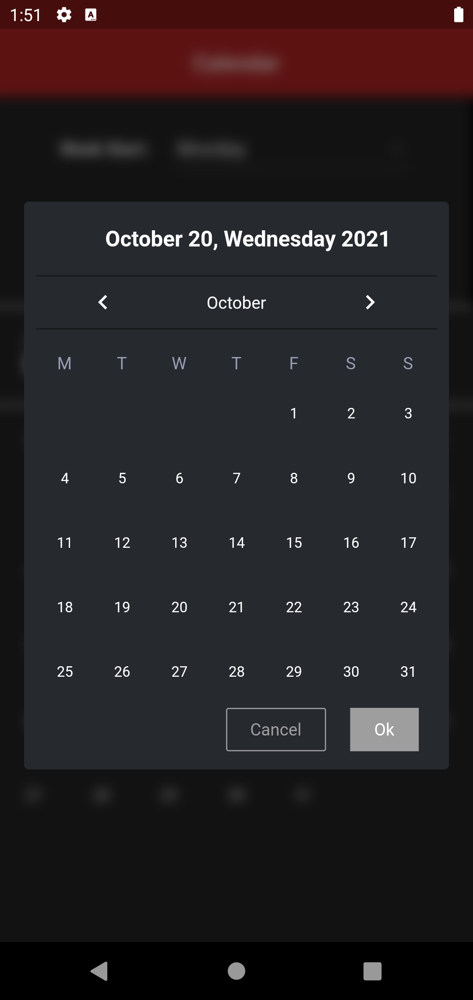
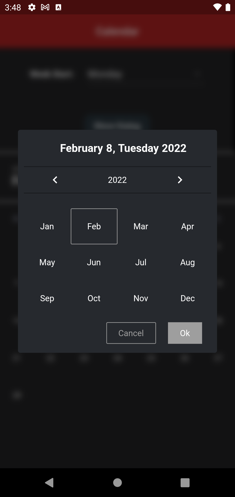
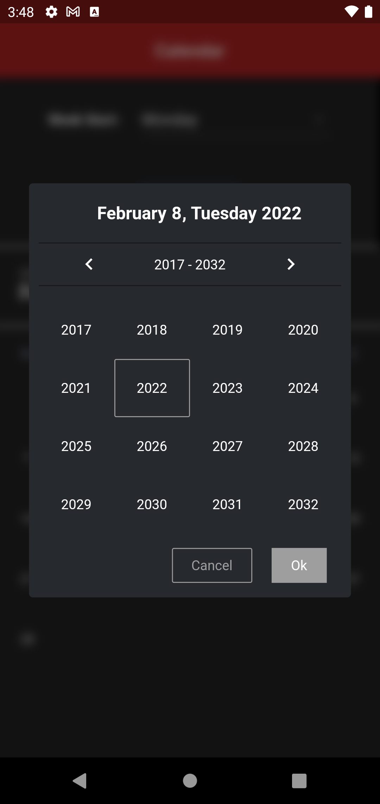
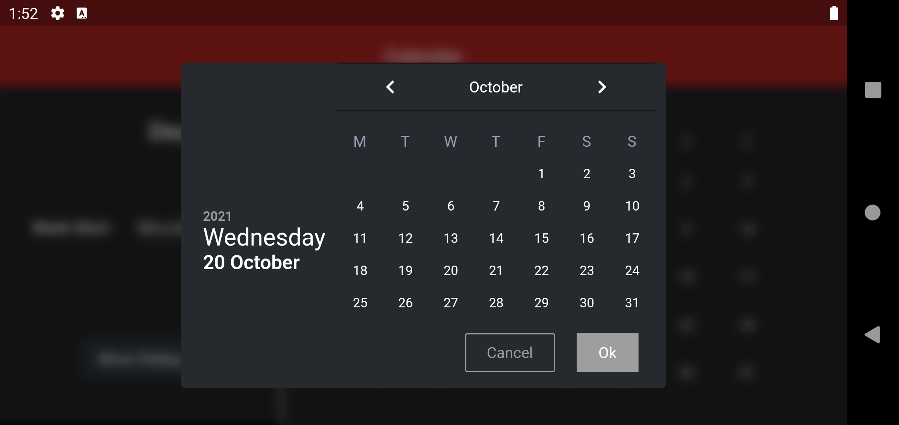
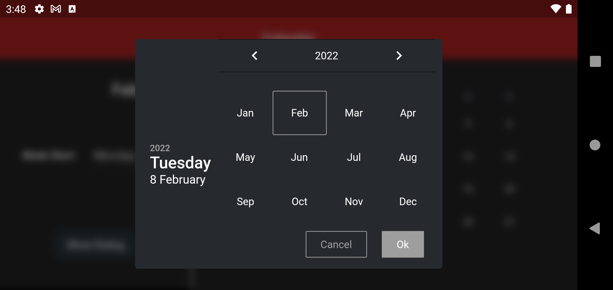
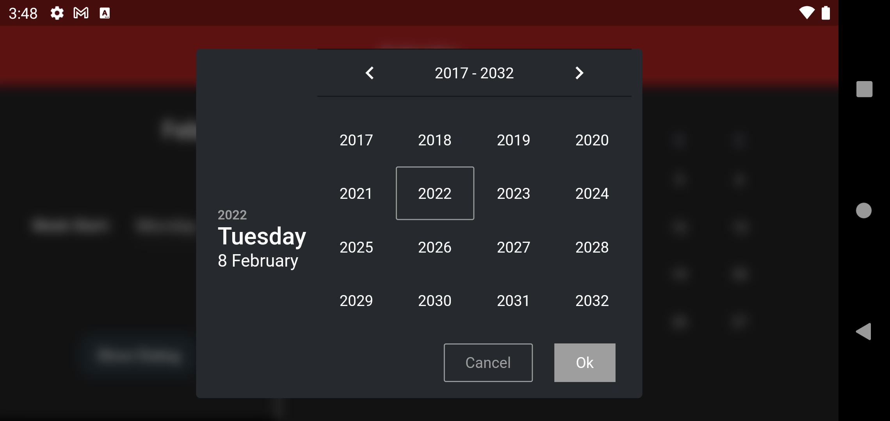

# Calendar

App that has Calendar Widget

- Home screen has a calendar widget which just shows a month and current date
- Also has a button to show a dialog which can be used to pick a date.  
  The dialog on dismiss shows return a supplied _dateTime_ or the _picked dateTime_

***

## Screenshots

### _Portrait_

Main screen | Week start drop-down
:----------:|:---------------------:
 | 

### _Landscape_

Mainscreen | Week start drop-down
:---------:|:--------------------:
 | 

## Dialog

Orientation | Date | Month | Year
:----------:|:----:|:-----:|:------:
Portrait Mode | |  | 
Landscape Mode |  |  | 