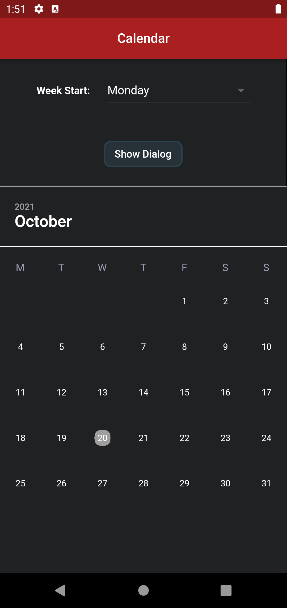
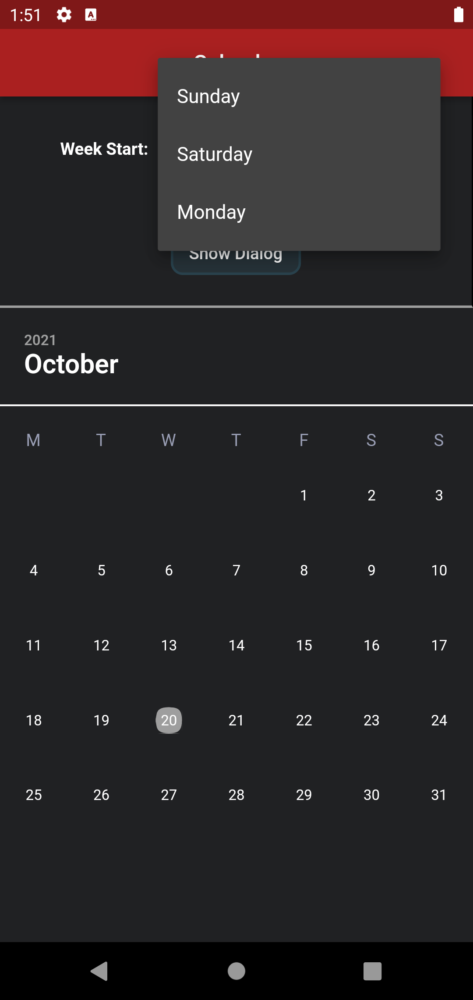
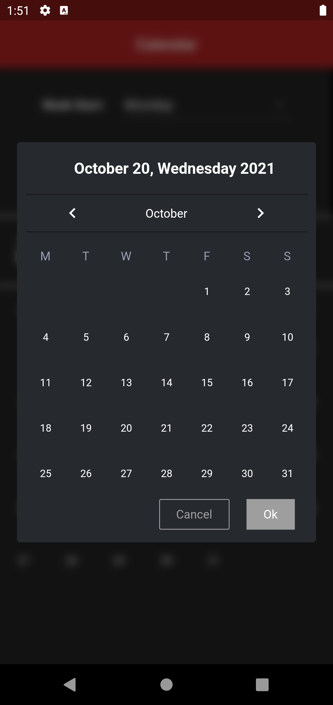
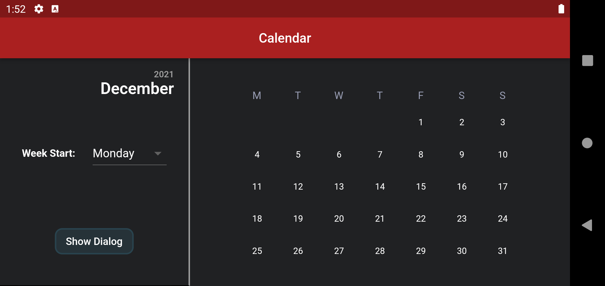
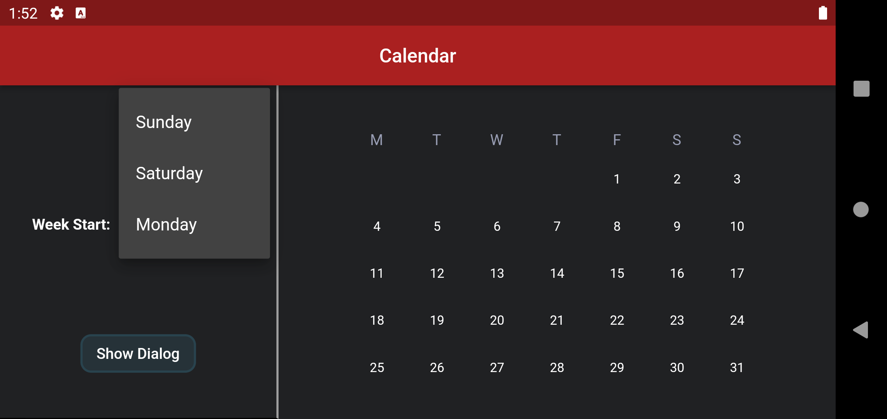
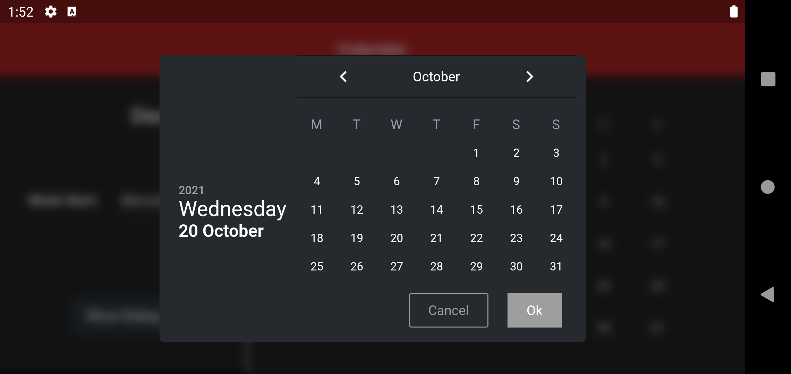

# Calendar

App that has Calendar Widget

- Home screen has a calendar widget which just shows a month and current date
- Also has a button to show a dialog which can be used to pick a date.  
  The dialog on dismiss shows return a supplied _dateTime_ or the _picked dateTime_

***

##  Screenshots

### _Portrait_

Mainscreen | Week start drop-down | DatePicker dialog
:--------------------:|:----------------:|:-----------------------:
 |  |   

### _Landscape_

Mainscreen | Week start drop-down | DatePicker dialog
:--------------------:|:----------------:|:-----------------------:
 |  |   
